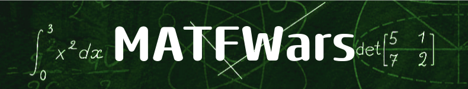

## Opis igre :chart_with_upwards_trend:

Matematičke igrice koje na zabavan način podstiču razumevanje i učenje funkcija i njihovih grafova. Moguće je izabrati jednu od dve igrice: War game i Guessing game. War game predstavlja mulitplayer igricu gde je cilj odgovarajućom matematičkom funkcijom pogoditi protivnika uz prepreke. Guessing game predstavlja singleplayer igricu različitih težina, gde je cilj pogoditi iscrtanu funkciju u određenom vremenu. 

## Demo snimak :movie_camera: 
- link:  <a href="https://youtu.be/1bQ0WO08_og?si=OqV3-kOoiXE8clap">MATFWars</a>

## Okruženje 
-   

## Programski jezik
-   *C++17*   
-   *Qt6*  

# Korisćene biblioteke :books:
- Qt >= 6.0
-  muparser link: https://beltoforion.de/en/muparser/. Po preporuci kreatora biblioteke, integrisana je u sam kod u src/lib/muparser.

## Instalacija :hammer:
- Preuzeti i instalirati [*Qt* i *Qt Creator*](https://www.qt.io/download)

## Preuzimanje i pokretanje :wrench:
1. `git clone git@gitlab.com:matf-bg-ac-rs/course-rs/projects-2023-2024/MATFWars.git`
2. Za WarGame potrebno je posebno otvoriti i pokrenuti CMake fajl u server folderu.

## Članovi :computer:
 - <a href="https://gitlab.com/miletaj">Mileta Jovanović 32/2020</a>
 - <a href="https://gitlab.com/Divljo31">Nemanja Divljaković 56/2020</a>
 - <a href="https://gitlab.com/tamarabaranin">Tamara Baranin 137/2020</a>
 - <a href="https://gitlab.com/milicakuzet02">Milica Kužet 64/2020</a>
 - <a href="https://gitlab.com/andreadj">Andrea Đukanović 105/2020</a>
 - <a href="https://gitlab.com/lazar01">Lazar Bećarević 93/2020</a>
